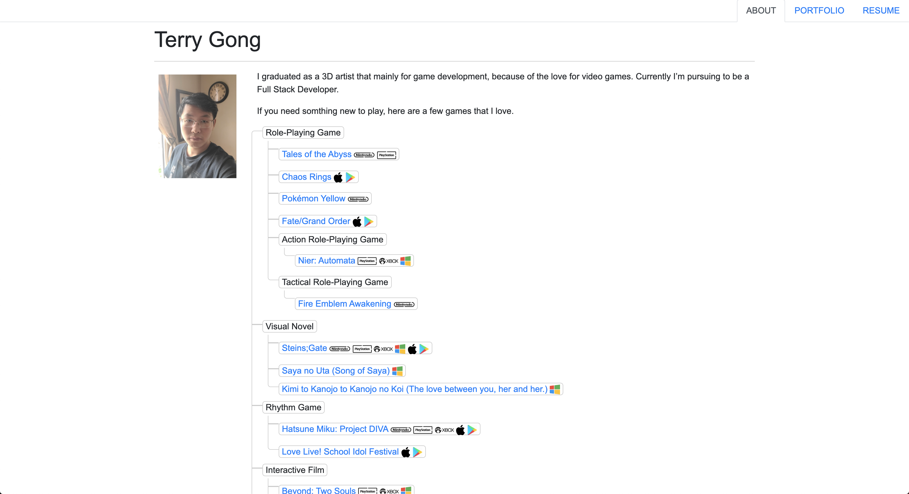
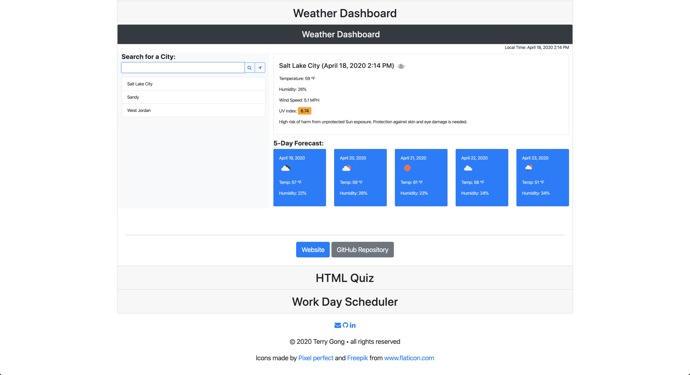

# Homework 2
Create a responsive sample portfolio page using bootstrap CSS framework.

## Link
[Portfolio](https://terry0532.github.io/Portfolio/)

## Screenshot

About page with a list of games.

Project page and footer.

## License
[MIT License](https://choosealicense.com/licenses/mit/)